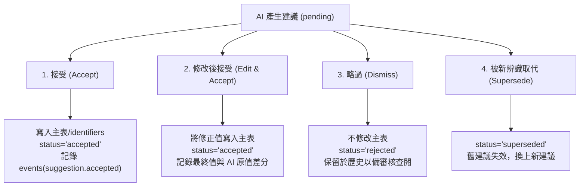
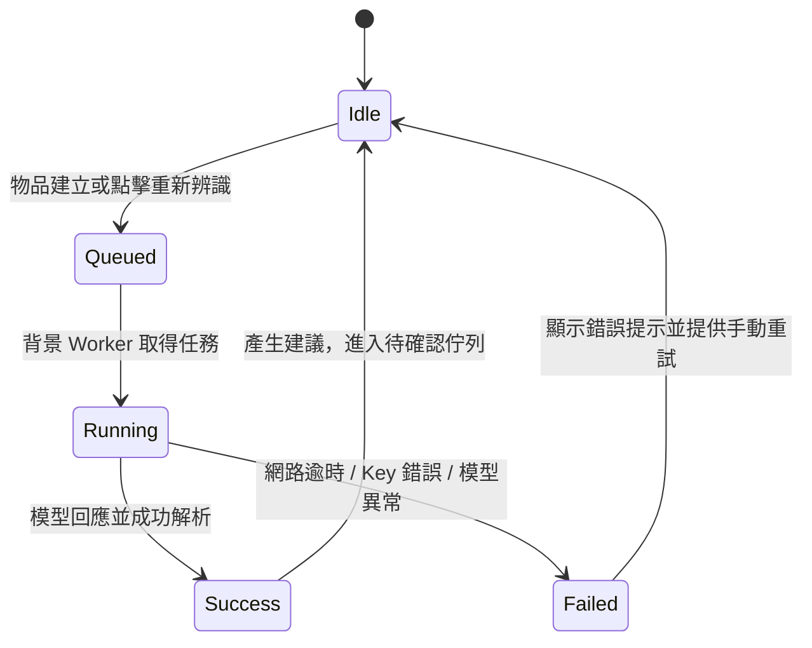

# 7. AI Experience & Strategy

本文件定義 ItemTrace V3 的人工智慧（AI）體驗架構、互動模式、審核機制與錯誤處理策略。

---

## 1. 核心定位：背景草稿員（Background Drafter）

### 1.1 從「按鈕」到「背景草稿」
在 V2 中，AI 是一個「需要使用者記得去按」的次要按鈕（「AI 自動填入」），點擊後畫面卡住等待數十秒，失敗時跳出模態錯誤窗。

在 V3 中，AI 被重新定義為：**一位手腳勤快、但自知可能出錯的背景實習草稿員**。
* **建檔時**：拍完照片按下「建立」，AI 自動在背景默默開始閱讀照片並撰寫草稿，不卡住使用者去拍下一件。
* **呈遞時**：AI 的建議直接貼在每個欄位旁，並附上「我是看哪張照片的哪裡推測出來的」。
* **最終權限**：AI 永遠無法動搖資料庫的正式事實欄位（`items`）。任何一筆進入正式紀錄的值，背後都必須有使用者的意圖背書。

### 1.2 核心原則（遵守 Product Principle P2）
1. **推論與事實分離（Inference vs. Fact）**：
   - 伺服器資料庫中，`suggestions`（推論）與 `items` / `identifiers`（事實）維持絕對實體隔離。
   - UI 視覺上，推論有專屬的色彩、標籤與文字樣式，絕不與正式資料混為一談。
2. **機器提案，人簽名（Machine Proposes, Human Signs）**：
   - 任何欄位在被接受前，在資料庫中就是空字串或原本的人工值。
   - 搜尋與標籤輸出預設只讀取正式事實，不讀取待確認的推論。
3. **可追溯來源（Visual Provenance）**：
   - 每個建議（尤其是序號）必須指向 `source_photo_id`。審核時點擊即可直達來源照片特寫。
4. **識別碼永不自動批次放行**：
   - 描述性欄位（品名、型號）可一鍵套用，但識別碼（序號）牽涉法律與交易爭議，**強制要求逐筆人眼對齊來源照片**。

---

## 2. 審核互動模型（Review Interaction Model）

### 2.1 雙層審核介面
ItemTrace V3 提供兩種審核 AI 草稿的介面維度：

#### A. 專注審核模式（Focus Review — 在 `/review/:id`）
* **適用情境**：在桌機前批次清空剛建檔的 5 件物品。
* **佈局**：
  - **左側（60%）**：全功能照片高解析檢視器，預載第一張識別碼標籤照片，滑鼠滾輪支援 100%~400% 深度縮放。
  - **右側（40%）**：草稿簽署面板。
* **按鍵流暢度**：
  - `A`：接受目前欄位建議。
  - `D`：略過（Dismiss）目前欄位建議。
  - `E`：編輯並接受。
  - `Space`：切換下一張來源照片。
  - `Enter`：完成目前物品並前進至佇列下一件。

#### B. 內嵌欄位審核（Inline Dossier Review — 在 `/i/:id`）
* **適用情境**：日常打開單一物品，隨手微調。
* **佈局**：建議直接作為「草稿標籤」依附於欄位下方。
  - 例如在「型號」輸入框下方出現：`[ ✨ ROG STRIX B650E-F (信心 88%) | ✓ 接受 | ✕ 略過 ]`。
  - 使用者可以直接點「✓ 接受」，或直接在輸入框打字；一旦使用者自行輸入不同文字並存檔，AI 建議自動變為「已被覆蓋」狀態。

---

## 3. 欄位處理策略與建議生命週期

### 3.1 欄位對應矩陣

| 欄位類型 | 包含欄位 | AI 的角色 | 審核政策 | 來源照片關聯 |
|---|---|---|---|---|
| **基本身分** | 品名 (`name`)、品牌 (`brand`)、型號 (`model`)、類別 (`category`) | OCR 與視覺辨識綜合歸納 | 允許單筆接受，亦提供「一鍵接受所有基礎屬性」 | 建議關聯主外觀照片 |
| **關鍵識別** | 序號 (`serial`)、IMEI (`imei`)、條碼 (`barcode`) | 字元級精確 OCR，逐字照抄 | **強制逐筆對照檢視**；禁止包含在一鍵全收中 | **強制關聯標籤特寫照片** |
| **狀態描述** | 外觀與狀況 (`condition`) | 瑕疵、刮痕、磨損的視覺敘述草稿 | 人為閱讀審閱，鼓勵微調後接受 | 關聯瑕疵特寫照片 |
| **內部備註** | `notes` | 輔助提示（如包裝內含配件） | 選用接受 | 可選 |

### 3.2 決策動作的四種可能

### 3.3 修改後接受（Edit & Accept）的產品價值
AI 在辨識序號時，最常見的問題是「差一個字元」（例如將 `B650E` 誤讀為 `B65OE`，將 `0` 與 `O` 混淆）。
在舊系統中，使用者若發現錯一個字，只能點「拒絕」，然後自己從頭手打 15 碼序號，體驗極差。
在 V3 中引入 **「修改後接受」**：
1. 點擊建議旁邊的「✎ 修改」。
2. 輸入框直接預填 AI 建議的文字，游標自動聚焦。
3. 使用者只修改那一個錯字，按下儲存。
4. 後端將修訂後的值寫入正式欄位（或建立 identifier），並標記該建議為 `accepted`，同時在 `events` 稽核負載中記錄「AI 原值」與「使用者修正值」，使演算法缺陷亦有據可查。

---

## 4. 重新辨識（Re-analysis）與版本遞更

當使用者拍了新照片（例如補拍了清晰的序號貼紙）並要求「重新辨識」時：
1. **已決定的不被覆蓋**：過去已經被使用者「接受」或「略過」的建議屬於正式歷史，絕不被新一輪分析動搖。
2. **未決定的自動標記為失效（Superseded）**：
   - 尚處於 `pending` 狀態的舊建議，在產生新一輪建議前被後端批量更新為 `status='superseded'`。
   - 畫面上清爽地展示最新一輪的建議，避免多輪推論互相堆疊造成視覺混亂。

---

## 5. 辨識狀態機與非同步架構

後端在 Level 2 引入非同步排程支援，在前端呈現完整的生命週期狀態：

### 5.1 前端回饋設計
* **辨識中 (Running)**：
  - 物品履歷上方顯示細緻的紫藍色流動光條（Indeterminate progress bar）。
  - 欄位旁顯示輕量骨架屏（Skeleton loading）。
  - 使用者完全不需停留在本頁，可自由切換到其他頁面；完成時首頁頂部的注意事項列數字自動更新。
* **零建議 (No Suggestions)**：
  - 若模型回應「照片未讀出有效商品資訊」：不報錯，溫和提示「AI 未在照片中辨識出型號或序號標籤。建議補拍清晰標籤照片，或手動填寫。」

---

## 6. 錯誤分類與降級處理（Error Handling & Redaction）

呼叫外部 Vision AI 模型時，必須將錯誤明確分類，給予使用者精確且安全的處置建議，**同時絕不可外洩 API Key**：

| 錯誤類型 | 觸發原因 | 前端顯示之人類語言 | 使用者因應動作 |
|---|---|---|---|
| **AUTH_ERROR** | API Key 無效、欠費或停用 | `「AI API 金鑰認證失敗。請檢查設定中的 Key 是否正確。」` | 引導至 `/settings/ai` 更新 Key |
| **QUOTA_ERROR** | 超過 Provider 速率限制或配額耗盡 | `「已達 AI 服務用量上限，請稍後再試或檢查帳戶配額。」` | 提供「稍後重試」按鈕 |
| **TIMEOUT** | 照片過大、網路延遲超過 120 秒 | `「連線至 AI 服務逾時。建議檢查網路或改用較穩定的模型。」` | 一鍵重試 |
| **PROVIDER_DOWN** | OpenRouter 或 Google 服務器 5xx 故障 | `「AI 服務商暫時無法使用，服務商回報：[安全的錯誤代碼]」` | 暫時手動填寫，稍後重試 |
| **NO_ORIGINALS** | 物品中沒有 original 照片 | `「此物品尚無原始照片，無法進行影像辨識。」` | 引導拍照 |

### API Key 安全承諾
* 任何錯誤訊息字串在送至前端前，必先經過後端 `ai_config.redact()` 正則脫敏，抹除所有類似 `sk-or-v1-...` 或 `AIzaSy...` 的字串特徵。
* 前端設定頁面上，API Key 欄位永不回填，僅顯示「已設置 (●●●●●●●●)」。

---

## 7. 支援的 AI 提供商與模型

系統預設支援符合 OpenAI Chat Completions 規範的多模態視覺端點：

1. **Google Gemini（官方直連 / 推薦）**：
   - 預設端點：`https://generativelanguage.googleapis.com/v1beta/openai`
   - 預設模型：`gemini-2.5-flash`（性價比高、速度極快、繁體中文與 OCR 能力卓越）。
2. **OpenRouter（高彈性路由）**：
   - 預設端點：`https://openrouter.ai/api/v1`
   - 預設模型：`google/gemini-2.5-flash` 或 `anthropic/claude-3.5-sonnet`。
3. **自訂相容端點（Custom Endpoint）**：
   - 支援本地模型伺服器（如 vLLM、Ollama、LocalAI）或任何代理閘道。

