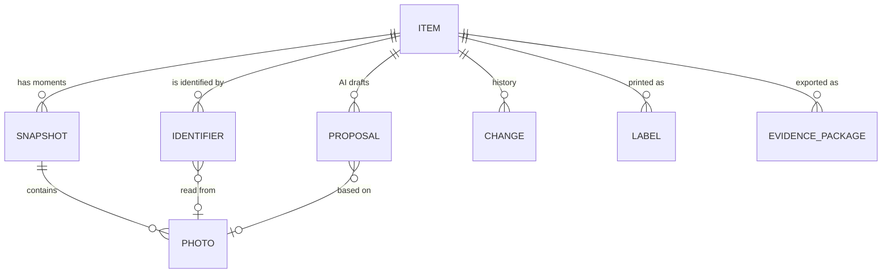
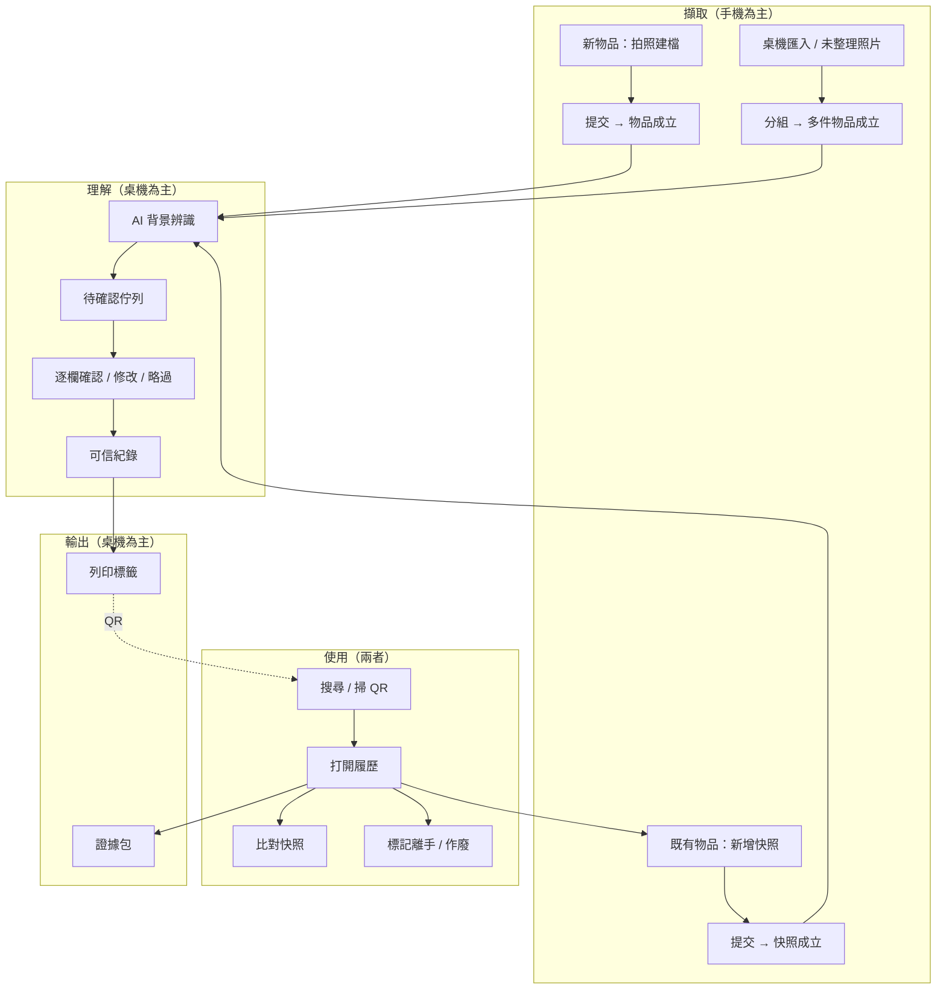
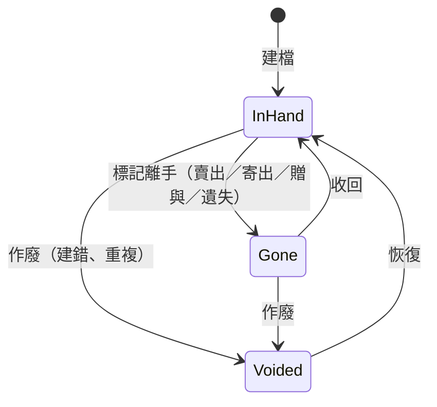
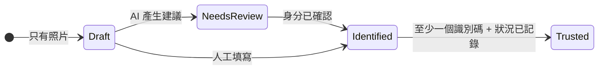
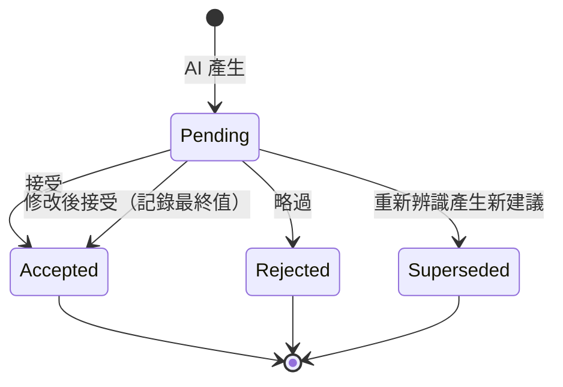
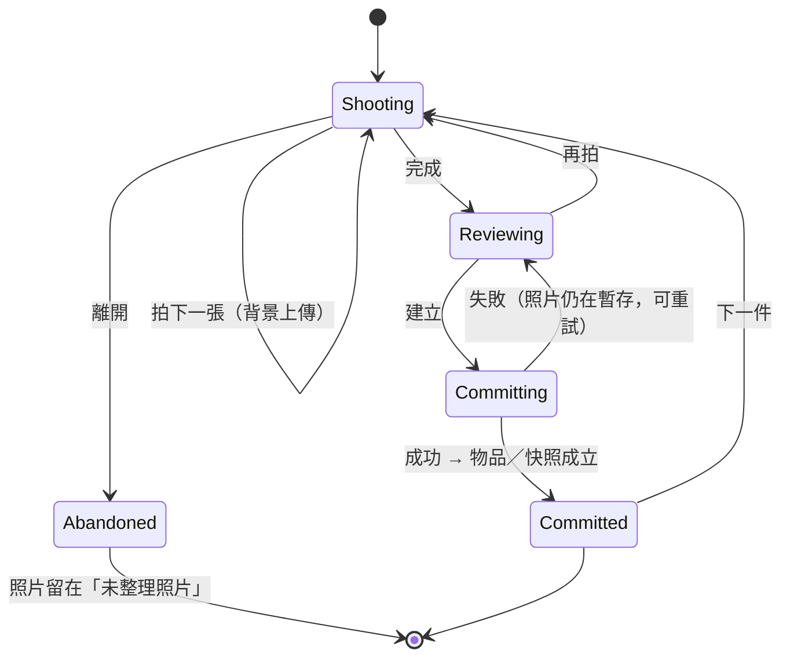

# 4. Product Architecture

本文件定義 V3 的**產品模型**：使用者心中有哪些「東西」、它們之間的關係、它們有哪些狀態，以及每個重大決策的理由。

> 設計方向：**User Need → Mental Model → Workflow → Product Structure**，最後才對應到 backend。

---

## 1. 使用者的心智模型

在訪談式推演中（以 Persona A、B 走過 Job Map），使用者描述一件東西時，用的是這樣的語言：

> 「這張是我上個月收的 **4070**（身分），**序號尾數 1234**（識別），**盒子有點壓到**（狀況）。**我寄出前有拍**（某一刻的樣子），**後來買家退回來**（又一刻）。」

這句話裡有四種東西：

1. **一件東西本身**（它是什麼）
2. **它的身分證明**（序號、條碼）
3. **它在某些時刻的樣子**（照片 + 當下的說明）
4. **它經歷過的事**（買進、寄出、退回、改過什麼）

使用者**從不**提到：Observation、Suggestion、Event、Inbox、Intake、Role、Derived。這些是 backend 的正確抽象，但不是產品概念。

---

## 2. 產品物件模型

### 2.1 主要物件

| 產品物件 | 中文 UI | 使用者理解 | backend 對應 | 是否為使用者可見的「概念」 |
|---|---|---|---|---|
| **Item** | 物品 | 一件（或一組）實體東西 | `items` | ✅ 主概念 |
| **Dossier** | 履歷 | 打開一件物品時看到的整份紀錄 | `GET /api/items/{id}` 組合 | ✅（是「物品」的頁面名稱，不是另一個物件） |
| **Snapshot** | 快照 | 物品在某一刻的樣子：一組照片 + 目的 + 註記 | `observations` + `photos` | ✅ |
| **Photo** | 照片 | 證據本身 | `photos`（只顯示 `role='original'`） | ✅ |
| **Identifier** | 識別碼 | 序號、IMEI、條碼、自訂碼 | `identifiers` | ✅ |
| **Proposal** | AI 建議 | AI 從照片讀到、等我確認的值 | `suggestions`（pending） | ✅（但只以「欄位上的建議」出現，不是獨立頁面） |
| **Change** | 變更 | 誰在何時改了什麼，可復原 | `events` | ✅（在時間軸中） |
| **Timeline** | 時間軸 | 快照 + 重要變更的時間序 | `observations` ∪ `events` 合併 | ✅ |
| **Label** | 標籤 | 貼在實體上、可掃回履歷的貼紙 | `templates` + print | ✅ |
| **Label Design** | 標籤樣式 | 標籤長什麼樣 | `templates` | ⚠️ 只在設定 |
| **Evidence Package** | 證據包 | 可交給別人的完整紀錄 | evidence export | ✅ |
| **Capture Session** | 拍照建檔 | 「我正在拍這一件」 | `inbox/<session>/` + intake | ✅（作為流程，不作為地方） |
| **Unsorted Photos** | 未整理照片 | 進來了但還沒屬於任何物品的照片 | `inbox/` 其餘檔案 | ⚠️ 只在非空時出現 |
| **Review Queue** | 待確認 | 有 AI 建議等我確認的物品 | 衍生（pending suggestions > 0） | ✅（作為佇列，不是物品狀態） |

### 2.2 被刻意隱藏的 backend 概念

| backend 概念 | 為什麼不暴露 | 使用者看到什麼 |
|---|---|---|
| `observation.kind`（intake/recheck/manual） | 使用者在意的是「為什麼拍」不是「第幾次拍」 | 快照的**目的**（見 §4.3）；第一個快照標記為「建檔」 |
| `photo.role`（original/derived） | derived 是縮圖快取，不是使用者的東西 | 只有照片 |
| `suggestion.status = superseded/rejected` | 歷史雜訊 | 只在「完整變更紀錄」與證據包中 |
| `event.actor = external/system` | 技術詞 | 「AI」「系統」「你」 |
| `events` 的 entity_type、ULID | 技術細節 | 自然語言的變更描述 |
| Inbox 資料夾 | 暫存區是實作，不是概念 | 「拍照建檔」流程；「未整理照片」 |
| `attributes` JSON | 擴充欄位的容器 | 具名的「選用事實」：取得、保固、存放位置 |
| Template HTML | 進階功能 | 標籤樣式選擇；「進階：編輯 HTML」藏在設定 |

---

## 3. 主要 Workflows（產品層級）

---

## 4. 狀態模型

### 4.1 物品生命週期（儲存的狀態，`items.status`）

| backend | zh-TW | en | 意義 | 預設可見 |
|---|---|---|---|---|
| `active` | **在手上** | In hand | 物品目前在我掌控中 | ✅ 物品庫預設 |
| `archived` | **已離手** | Gone | 物品已不在我手上，但紀錄仍然重要（**而且常常最重要**） | 篩選「已離手」或「全部」 |
| `void` | **已作廢** | Voided | 這筆紀錄本身是錯的（建錯、重複） | 只在篩選「已作廢」 |

> 為什麼不叫「封存」：使用者會把「封存」理解成「整理掉、不重要了」。但對 Persona A，離手的物品正是最可能發生爭議的物品。「已離手」準確描述事實，又不暗示紀錄不重要。

### 4.2 紀錄完整度（衍生狀態，不儲存）

| 衍生狀態 | 判定（前端計算，見 FRONTEND-ARCHITECTURE §6） | UI 呈現 |
|---|---|---|
| **待確認** Needs review | `pending suggestions > 0` | 待確認佇列；履歷頂部的建議列；物品卡片上的小點 |
| **未命名** Unnamed | `name == ''` 且無 pending name 建議 | 卡片顯示「未命名物品 · ITM-0042」；完整度提示 |
| **已辨識** Identified | `name != ''` | — |
| **可信** Trusted | 已辨識 + ≥1 識別碼 + `condition != ''` + ≥3 張照片 | 完整度清單全打勾（不顯示徽章；完整是常態，不是獎勵） |

**完整度是提示，不是門檻**（原則 P4）。完整度清單只出現在履歷的「事實」區塊，可收合，不會出現紅色警告。

### 4.3 快照（Snapshot）

| 屬性 | 來源 |
|---|---|
| 時間 | `observations.captured_at`（照片 EXIF 推得）或 `created_at` |
| 目的 | **新增** `observations.purpose`（Level 2，見 BACKEND-IMPACT B2-3） |
| 註記 | `observations.note` |
| 照片 | `photos where observation_id = …` |

**快照目的**（封閉集合 + 其他）：

| purpose | zh-TW | en | 典型 Persona | 何時建議 |
|---|---|---|---|---|
| `intake` | 建檔 | Recorded | 全部 | 第一個快照自動帶入 |
| `acquired` | 取得 | Acquired | B | 新物品建檔時可選 |
| `pre_ship` | 寄出前 | Before shipping | A | 物品「在手上」時 |
| `handover` | 交付／借出 | Handed over | A、B | 物品「在手上」時 |
| `returned` | 收回 | Received back | A、B | 物品「已離手」時（自動置頂） |
| `repair` | 送修／維修 | Repair | B | — |
| `check` | 例行檢查 | Check-up | B | — |
| `note` | 註記 | Note | 全部 | 只有文字、沒有照片 |
| `other` | 其他 | Other | 全部 | — |

> 為什麼是封閉集合：目的要能篩選（「顯示所有寄出前快照」）、要能驅動後續建議（「寄出前」後問「要標記為離手嗎？」；「收回」後問「要恢復為在手上嗎？」並引導比對）。自由文字做不到。
>
> 若 Level 2 尚未施工：前端以 `kind` 推得「建檔／後續」，目的選擇暫不顯示（見 IMPLEMENTATION-PLAN Phase 2 的降級方案）。

### 4.4 AI 建議（Proposal）

### 4.5 AI 辨識工作（物品層級，Level 2）

| 狀態 | 意義 | UI |
|---|---|---|
| `idle` | 沒有進行中的辨識 | — |
| `queued` / `running` | 辨識中 | 履歷照片上方細進度條；卡片上「辨識中…」 |
| `failed` | 最近一次失敗 | 履歷：可重試的內嵌訊息（含原因分類） |
| `done` | 完成（可能 0 筆建議） | 0 筆時：「AI 沒有讀到可用的資訊，請手動填寫或補拍標籤」 |

### 4.6 Capture Session（前端狀態 + inbox 子資料夾）

每張照片自己的上傳狀態：`queued → uploading → staged → (committed)`，失敗則 `failed → retry`。照片在伺服器確認前保存在瀏覽器 IndexedDB（見 FRONTEND-ARCHITECTURE §7）。

---

## 5. 重大決策紀錄

### D1. 定位：可信履歷，而非泛用盤點

| | |
|---|---|
| **Problem** | 「個人物品管理」太寬，讓產品變成沒有特色的資料表 UI；V2 把最強的能力藏起來 |
| **Insight** | backend 的獨特資產是 provenance；高頻、高痛點的使用者（二手賣家、器材持有者）都在「轉手時刻」需要它 |
| **Decision** | 定位為「實體物品的可信履歷」，主要服務 Persona A、B |
| **Why** | 差異化、頻率、backend 對位三者同時成立 |
| **Trade-off** | 放棄「全屋盤點」的廣度；需要克制功能蔓延 |
| **Alternative** | 居家盤點（擁擠、低留存）；純證據工具（太負面、太窄） |

### D2. 移除 Inbox 作為一個「地方」

| | |
|---|---|
| **原本解決的問題** | ① 照片進來的方式不一（手機上傳、資料夾丟入），需要一個緩衝區；② 一批照片可能包含多件物品，需要分組；③ 讓「拍」與「建檔」可以分開做 |
| **Problem** | ① Inbox 是**整理照片**的心智模型，但使用者想做的是**建立一件物品**；② 依時間間隔自動分組不可靠（同一時間拍兩件東西就錯）且需要使用者理解「間隔分鐘數」；③ Inbox 會累積，變成罪惡感來源；④ 多一個步驟、多一個頁面、多一個概念 |
| **Insight** | 在手機上拍照時，使用者**當下就知道**這些照片屬於哪一件東西。這個資訊最便宜的取得時機是拍照當下，而不是事後從時間戳猜回來 |
| **Decision** | ① 主要流程改為 **Capture Session**：每次拍照都屬於「這一件」，按「下一件」明確切分；② 暫存區（`inbox/`）保留為 backend 機制，每個 session 一個子資料夾；③ 其他來源（桌機匯入、資料夾丟入、被放棄的 session）出現在 **「未整理照片」**，只在非空時出現在導覽中；④ 桌機匯入時才使用時間分組，而且是**可編輯的建議**（拖曳合併／拆分），不是一個分鐘數下拉選單 |
| **Why** | 把分組資訊的取得時機移到最便宜、最準確的時刻；移除一個常駐概念；未整理照片不會消失（P1） |
| **失去什麼** | 「先全部丟進來、之後再慢慢整理」作為主要工作方式 |
| **如何替代** | 「未整理照片」仍支援這種工作方式（桌機匯入、資料夾丟入），只是不再是預設與首頁 |
| **Alternative** | ① 保留 Inbox 並改善分組（仍是錯誤的心智模型）；② 完全刪除暫存區、直接上傳到物品（失去「提交前可刪除」與「放棄的照片不遺失」） |

### D3. 提交點 = 證據點

| | |
|---|---|
| **Problem** | 拍照時常拍錯（手指、模糊、拍到別件）。但 backend 原則是「原始照片不可刪除、不可跨物品搬移」 |
| **Insight** | 原則保護的是**證據**。拍照當下、還沒按「建立」的照片，還不是證據，是草稿 |
| **Decision** | Capture Session 中的照片位於 `inbox/<session>/`，**可刪除**（Level 1 新增只作用於 inbox 子樹的刪除端點）。按下「建立／加入」的瞬間，照片透過既有 `intake()` 原子地成為原始證據，此後只能作廢物品，不能刪除或搬移照片 |
| **Why** | 在不違反 P1 的前提下，給使用者拍照時應有的自由 |
| **Trade-off** | 提交後發現拍錯物品，只能作廢重拍（或在履歷中把該快照註記為「拍錯」），不能搬移 |
| **Alternative** | 開放照片跨物品搬移（違反 SPEC-v1 PhotoPatch 的明確設計，且讓 provenance 變複雜） |

### D4. Item 的名稱與頁面：物品 / 履歷

| | |
|---|---|
| **Problem** | 「商品」只屬於賣家；「Item」太資料庫；「Asset」太企業 |
| **Insight** | 使用者打開一件東西時想看的是它的**一生**：出身、特徵、經歷。這是「履歷」 |
| **Decision** | 物件叫 **物品**（Item），頁面叫 **物品履歷**（Dossier）。ID `ITM-0001` 保留且顯著呈現，作為實體標籤上的「身分證號」 |
| **Why** | 中性、涵蓋 A/B/C/D；「履歷」傳達「會長大的紀錄」與可信度 |
| **Trade-off** | 「履歷」在台灣也有求職含義；在 UI 中幾乎總是以「物品履歷」完整出現以避免歧義 |
| **Alternative** | 檔案（Archive，太靜態）、卷宗（Dossier 直譯，太正式）、紀錄（太泛） |

### D5. Observation → 快照（帶目的）

| | |
|---|---|
| **Problem** | Observation 是正確的抽象，但「觀測」對使用者無意義；`kind` 的 intake/recheck/manual 不描述**為什麼**拍 |
| **Insight** | 重要的紀錄發生在轉手時刻；「為什麼拍」決定之後要拿它做什麼（寄出前 ↔ 收回 比對） |
| **Decision** | 產品名稱改為**快照**，新增**目的**（§4.3）；「只有文字」的紀錄是目的為「註記」的快照 |
| **Why** | 讓時間軸可讀、可篩選，並驅動後續動作建議 |
| **Trade-off** | 需要一個 Level 2 additive 欄位與遷移機制 |
| **Alternative** | 把目的寫進 note（無法篩選、無法驅動流程）；擴充 `kind` 的 CHECK（需要重建表，Level 3） |

### D6. 合併 Events 與 Observations 為一條時間軸

| | |
|---|---|
| **Problem** | V2 有「照片牆」「觀測」「修改歷史」三個區塊；使用者要自己在腦中合併「那天拍了照、也改了狀況描述」 |
| **Insight** | 使用者問的是「這件東西發生過什麼」，不是「資料表 A 和資料表 B 各有什麼」 |
| **Decision** | 一條**時間軸**：快照是主要節點（大，有照片）；重要變更是次要節點（小，一行文字，可展開看前後值與復原）；細瑣變更（同一次編輯的多個欄位、AI 建議產生）會被**聚合**。「完整變更紀錄」作為時間軸的篩選，顯示所有原始 events |
| **Why** | 一個心智模型取代三個；快照之間的變更提供脈絡 |
| **Trade-off** | 聚合規則需要設計（見 UX-DESIGN §5.6）；原始事件不再一眼可見 |
| **Alternative** | 分頁「照片／歷史」（V2 的做法） |

### D7. 沒有 draft；「待確認」是衍生佇列

| | |
|---|---|
| **Problem** | 使用者需要知道「哪些還沒整理完」，但 SPEC-v1 明確拒絕 `draft` 狀態 |
| **Insight** | SPEC 的理由是對的：「物品是否有效」與「資料是否已填」是兩件事。使用者需要的是**待辦清單**，不是物品狀態 |
| **Decision** | 「待確認」= 有 pending 建議的物品，作為導覽中的一個**佇列**（帶數字徽章）；物品本身狀態不受影響 |
| **Why** | 保留 backend 的正確決策，同時提供明確的工作佇列 |
| **Trade-off** | 沒有 AI 時，「未命名」的物品不會進入待確認 —— 用物品庫的「未命名」篩選與完整度提示補足 |
| **Alternative** | 新增 draft 狀態（Level 3，且混淆兩件事） |

### D8. AI 是背景草稿員

詳見 [AI-EXPERIENCE.md](AI-EXPERIENCE.md)。摘要：建檔後自動辨識（可關閉）；建議直接顯示在欄位上；支援修改後接受；重新辨識會取代舊的未決建議。

### D9. 識別碼永不批次接受

| | |
|---|---|
| **Problem** | 「全部接受」很方便，但 AI 讀錯一個字元的序號，在證據情境下是災難 |
| **Insight** | 序號是使用者說的「身分證」。錯一字比沒有更糟，因為它會讓人誤以為有證據 |
| **Decision** | 「接受全部高信心建議」只作用於描述性欄位（名稱、品牌、型號、類別）。識別碼必須在**來源照片放大檢視**旁逐筆確認；狀況描述也不批次接受（它是證據敘述，需要人讀過） |
| **Why** | 原則 P2；把人的注意力花在最需要的地方 |
| **Trade-off** | 多一兩次點擊 |
| **Alternative** | 依信心門檻自動接受（拒絕：信心值不是正確率） |

### D10. 列印 → 標籤（帶 QR）

| | |
|---|---|
| **Problem** | V2 的列印是「把資料印出來」的功能，沒有產品目的；範本管理暴露在一級設定頁 |
| **Insight** | 對 Persona A，標籤的價值不是「印出品名」，而是**讓實體物品帶著回到紀錄的入口**；這是 Flywheel 的物理錨點 |
| **Decision** | 標籤預設帶 QR，指向 `/i/ITM-0001`；手機系統相機掃了直接開履歷。新增 template binding `item.qr`、`item.url`。內建 2–3 個標籤樣式；HTML 編輯器降為「進階」 |
| **Why** | 把一個功能變成飛輪的一部分 |
| **Trade-off** | QR 內含 LAN 位址，IP 變動會讓舊標籤失效（見 R4 的對策：可設定的標籤連結網址、ID 永遠以文字印在標籤上、App 內搜尋接受掃描內容） |
| **Alternative** | QR 只編碼 `ITM-0001`（系統相機無法直接開啟）；不做 QR（失去飛輪錨點） |

### D11. Evidence Export → 證據包

| | |
|---|---|
| **Problem** | 現有匯出產生伺服器端資料夾 + manifest JSON，需要逐檔下載；接收者（買家、客服、保險）看不懂 JSON；events 只含物品本身、漏了識別碼與照片的事件 |
| **Insight** | 證據有兩個讀者：**人**（要看懂）與**機器**（要驗證）。兩者都需要 |
| **Decision** | 一鍵下載 **zip**：內含 `report.pdf`（人讀：照片、身分、識別碼與來源照片、快照時間軸、變更摘要、完整性說明）+ 既有 JSON + 原始照片 + manifest（含 hash）。修正 events 範圍為完整物品歷史，並加入 suggestions（AI 透明度） |
| **Why** | 讓「證明」這一步真的能交付 |
| **Trade-off** | 報告 PDF 需要沿用 Chromium pipeline（Level 2） |
| **Alternative** | 只做 zip（人仍看不懂） |

### D12. 不做首頁儀表板；物品庫就是首頁

| | |
|---|---|
| **Problem** | 「首頁」常被做成統計與捷徑的拼盤 |
| **Insight** | 單人工具的首頁只需要回答：「有什麼要我處理？」和「我要找什麼？」 |
| **Decision** | 首頁 = 物品庫，頂部一條**注意事項列**（待確認 N、未整理照片 N、AI 未設定、備份過久），之後是依最近更新排序的物品 |
| **Why** | 少一個目的地；首頁上的每個元素都可行動 |
| **Trade-off** | 沒有「總覽」的滿足感（刻意的） |
| **Alternative** | 儀表板（統計數字對單人使用者幾乎沒有行動價值） |

### D13. 選用事實放在 `attributes`，不加欄位

| | |
|---|---|
| **Problem** | Persona B 需要取得日期、取得來源、價格、保固到期、存放位置 |
| **Insight** | `items.attributes` 是 SPEC-v1 為「多品類欄位」預留的 JSON，已可 PATCH、已在搜尋範圍內、變更會寫 events |
| **Decision** | 定義一組**具名鍵**（見 BACKEND-IMPACT §3），前端以具名欄位呈現；不新增資料表欄位 |
| **Why** | 零遷移；搜尋自動涵蓋；可復原 |
| **Trade-off** | 無法用 SQL 有效排序／範圍查詢（保固即將到期篩選需在前端或小型 Level 1 端點中處理；以本產品規模可接受） |
| **Alternative** | 新增欄位（Level 3）；自訂欄位建構器（拒絕：複雜度高、價值低） |

### D14. 手機 Capture 使用系統相機，而非網頁取景器

| | |
|---|---|
| **Problem** | 理想的連拍體驗是網頁內即時取景器（`getUserMedia`） |
| **Insight** | 手機透過 `http://<LAN IP>` 連線，**不是 secure context**：`getUserMedia`、Service Worker、Web Share 全部不可用。`<input type="file" accept="image/*" capture="environment">` 不受此限制 |
| **Decision** | V3 以系統相機為主（每次快門回到 Capture 托盤，自動準備下一張）；HTTPS 模式列為 Future（解鎖取景器、PWA、離線 SW） |
| **Why** | 在真實部署環境下可靠運作 |
| **Trade-off** | 每張照片多一次「回到頁面」；以托盤的大按鈕與自動聚焦把成本降到最低 |
| **Alternative** | 要求使用者設定 HTTPS（self-signed 憑證在手機上的信任流程太難） |

### D15. 照片永不跨物品搬移

沿用 SPEC-v1 `PhotoPatch` 的明確設計。拍錯的修正路徑：提交前刪除（D3）、提交後作廢物品或以註記說明。物品合併／拆分列為 Future（需要完整事件設計）。

### D16. 設定收斂

設定只有五個區塊：**AI 辨識**、**標籤與列印**、**手機連線**、**資料與備份**、**語言與關於**。範本管理是「標籤與列印」的子頁；`/docs`（Swagger）只在「關於」中以開發者連結出現；`/design` 展示頁移除（設計系統以文件與開發用頁面存在，不屬於產品）。

### D17. 數量降級

`quantity` 保留（SPEC 的理由成立：一組 10 條線不需要 10 件物品），但只在 >1 或使用者主動編輯時顯示於履歷；物品卡片在 >1 時顯示「×10」。不在建檔流程中詢問。

---

## 6. 一致性檢查：每個 backend 能力在 V3 中的位置

| backend 能力 | V3 產品位置 | 暴露程度 |
|---|---|---|
| Items CRUD | 物品、履歷的身分與事實 | 主要 |
| Item status | 在手上／已離手／已作廢 | 主要 |
| Attributes | 選用事實（取得、保固、位置） | 次要 |
| Observations | 快照 | 主要 |
| Photos（original） | 照片檢視器、快照、托盤 | 主要 |
| Photos（derived） | 縮圖（看不見） | 隱藏 |
| Photo angle | 拍照時的角度標記（正面、背面、標籤、細節、瑕疵、收據） | 次要 |
| Photo sha256 / metadata | 照片資訊面板；證據包 | 安靜 |
| Identifiers + normalize + lookup | 識別碼、搜尋 | 主要 |
| Identifier collision 409 | 撞號卡片 | 情境性 |
| Suggestions | 欄位上的 AI 建議、待確認佇列 | 主要 |
| AI analyze | 背景辨識、重新辨識 | 主要（但不是按鈕） |
| Events | 時間軸、復原 toast、完整變更紀錄 | 主要（以自然語言） |
| Revert | 復原 | 情境性 |
| Inbox scan/upload/intake | Capture Session、未整理照片、桌機匯入 | 流程（不是地方） |
| Inbox group | 桌機匯入的分組建議 | 情境性 |
| Templates + validator + renderer | 標籤樣式 | 設定 |
| Print backend | 列印標籤 | 主要 |
| Evidence export | 證據包 | 主要 |
| Stats | 注意事項列、設定中的資料摘要 | 次要 |
| AI settings | 設定 → AI 辨識 | 設定 |
| Print settings | 設定 → 標籤與列印 | 設定 |
| Backup / verify（CLI） | 設定 → 資料與備份（Level 1 API） | 設定 |
| Health | 連線狀態指示 | 隱藏 |

