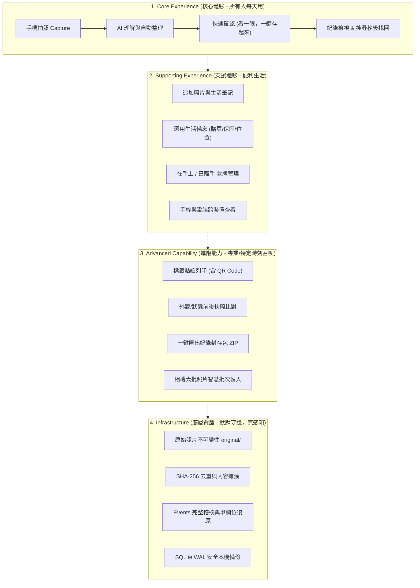

# 4. Product Architecture & Mental Models

本文件定義 ItemTrace V3 的四層架構模型、生活化的使用者心智物件、狀態模型，以及關鍵設計決策記錄。

---

## 1. 使用者心智模型（The User Mental Model）

在使用者心中，**「物品」不是一開始就必須預先建立或理解的概念，而是拍下照片後，由 AI 理解與整理所自然產生的產物**。

使用者眼裡只有非常純粹的四件事：

```text
┌────────────────────────────────────────────────────────┐
│                   使用者心中的「拍照記憶」模型           │
├────────────────────────────────────────────────────────┤
│ 1. 拍下來的照片 (Photos & Captures)                     │
│    我看到覺得值得留下的東西，隨手拍下的照片。          │
│                                                        │
│ 2. AI 整理出的結果 (AI Result / Draft)                 │
│    AI 讀懂照片後自動梳理出的品名、型號、規格與序號。    │
│    （若拍的是風景或隨手拍，AI 亦可保留為普通照片）     │
│                                                        │
│ 3. 留下來的紀錄 (Saved Records)                         │
│    確認存下後的整齊紀錄，日後隨手打兩個字就能秒級找回。│
│                                                        │
│ 4. 追加的筆記與照片 (Notes & Updates)                  │
│    日後補拍的狀況照片、換了什麼零件、隨手記下的備忘。  │
└────────────────────────────────────────────────────────┘
```

### 1.1 技術實作概念與生活化概念對照

| 後端抽象實作 (Implementation Concept) | 使用者看到的產品概念 (User Concept) | 為什麼這樣轉換 |
|---|---|---|
| `items` 資料表 | **整理好的紀錄 (Saved Record / Item)** | 「物品」是 AI 整理後的結果，不是使用者一開始被迫填寫的表單或庫存概念。 |
| `photos` 資料表 | **拍下來的照片 (Photos)** | 使用者拍下的原始相片，完整保留細節。 |
| `observations` 資料表 | **照片與追加筆記 (Photos & Notes)** | 使用者不關心什麼是「觀測」，他只知道「我拍了照片」或「我追加了筆記」。 |
| `suggestions` 資料表 (pending) | **AI 整理的結果 (AI Result / Draft)** | 使用者看到的是「AI 幫我整理好了，看一下，存起來」，不是「等待仲裁的提案實體」。 |
| `identifiers` 資料表 | **序號 / SN / 條碼** | 使用者只想在介面上看到清楚的序號，不需要理解「識別碼是獨立關聯表」。 |
| `events` 資料表 | **修改紀錄 (Changes)** | 使用者只需要在點開時看懂「某年某月改過狀態」，不需要面對 Event Sourcing 術語。 |
| `inbox/` 暫存資料夾 | **相機暫存緩衝 (Upload Buffer)** | 照片拍下後暫存，AI 整理後直接入庫，使用者無須管理 Inbox。 |

---

## 2. 產品四層架構模型（Four-Layer Architecture）



---

## 3. 狀態模型（State Model）

### 3.1 紀錄生命週期狀態（簡潔自然）
在資料庫中對應 `items.status`，前端只以自然語言呈現：
* **在手上（In Hand - 預設）**：物品目前在我掌控中。首頁預設只展示在手上的紀錄，保持生活清爽。
* **已離手（Gone）**：物品已經賣掉、送給朋友或淘汰，但紀錄隨時可查。
* **已作廢（Voided）**：拍照失誤或重複建檔作廢，預設隱藏。

### 3.2 AI 整理結果與確認狀態（超低摩擦）
不把草稿分成複雜的逐筆審核佇列，而是簡化為：
1. **理解與整理中**：拍完照後，介面呈現輕量微光：「AI 正在理解與整理…」
2. **整理完成草稿**：AI 整理出結構化結果，使用者看一眼，一鍵「存起來」。
3. **彈性產物判斷**：AI 辨識若為值得長期追蹤的物品，整理為完整紀錄；若為純粹隨拍（風景、寵物），則作為相片留存，不強行塞入物品規格欄位。
4. **已留存**：資料成為正式記錄，日後隨時可搜尋找回或追加補充。

---

## 4. 關鍵設計決策記錄（Updated Decision Records）

### D1. 產品核心：拍下來，AI 幫你記住，以後找得到
* **問題**：舊設計充斥「存證、防糾紛、鑑識、物品庫管理」等沉重詞彙，讓人感覺像是在維護複雜的資產資料庫。
* **決策**：產品核心定為 **「拍下來，AI 幫忙理解整理，以後找得到」**。
* **理由**：消滅打字與分類成本是普世痛點，使用體驗輕快驚喜；而不可篡改性、SHA-256、事件溯源退為安靜強大的底層護城河。

### D2. 移除常駐 Inbox，相機直達整理
* **問題**：舊 Inbox 強迫使用者先理解「上傳到收件匣 → 手動分組 → 再建檔」的三步心智。
* **決策**：手機打開就是大快門，連拍 2~4 張，AI 直接理解並整理，一鍵存起來。暫存區純作為背景上傳安全緩衝。

### D3. AI 不是輔助按鈕，而是「預設打草稿員」
* **問題**：舊設計需要使用者手動找「AI 自動填入」按鈕，像是在用一個額外外掛。
* **決策**：拍照完成後，系統預設自動呼叫 Vision AI 理解並整理。使用者打開看見的就已經是整理好的結果。

### D4. 超低摩擦確認：整體驗收，非強迫逐欄打勾
* **問題**：上一版設計要求使用者對品名、品牌、型號、類別、序號一個一個點「接受」，比手打還煩躁。
* **決策**：採用主管驗收模式——**「看起來都對？點一下［存起來］直接留存」**。只有發現 AI 讀錯時，才點進特定欄位修改。

### D5. 識別碼（序號）直觀呈現與來源照片對齊
* **問題**：既想保證序號準確度，又不能打斷流暢度。
* **決策**：序號作為整理結果的一等公民直接展示；點擊序號旁的小縮圖，能瞬間放大檢視當初拍到的標籤特寫照片，確認與修正極度直觀。

### D6. 實體標籤與 QR 降為「進階支援能力」
* **問題**：上一版把「印 QR 貼紙」當成每次必經的飛輪步驟，但不是每個人桌上都隨時接著標籤機。
* **決策**：標籤列印與 QR 綁定保留為強大的進階功能，藏在卡片與履歷的 `⋯` 選單中。想貼標籤的人隨時印，沒印的人靠搜尋一樣好用。

### D7. 完整變更歷史與復原退為「進階維護」
* **問題**：普通人不需要在首頁看到每一筆 `field.changed` 的技術流水帳。
* **決策**：主要時間軸展示「拍了什麼照片」「記了什麼筆記」；細微的欄位修改歷史收合在「查看變更紀錄」，提供單欄位復原。

