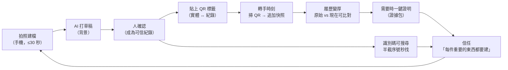

# 1. Product Vision

## 1.1 起點：重新讀一次 ItemTrace 的歷史

ItemTrace 不是從「居家物品管理」開始的。SPEC-v1 §0 寫得很清楚：

> 出貨前，東西已經離開視線就無法再確認它的樣子。日後對方說「這不是我寄的那個」或「收到就是壞的」，你手上沒有任何東西可以反駁。

這個起點決定了 backend 長成什麼樣子：

| backend 設計 | 它真正在服務的需求 |
|---|---|
| `original/` 照片不可覆寫、sha256、保留原始檔名與 EXIF 時間 | **這張照片是真的、是當時拍的** |
| `suggestions` 與正式欄位分離、被拒的建議也保留 | **哪些是機器猜的，哪些是人確認的** |
| `identifiers.source_photo_id` | **這個序號是從哪張照片讀到的** |
| 撞號回 409 而不是 UNIQUE 失敗 | **同一個序號出現兩次時，人要看得到** |
| `events` 保留前後值、可單欄位復原、復原本身也是事件 | **這筆資料為什麼長這樣** |
| Observation 可多次，`recheck` 不影響原始 Observation | **原始 vs 現在** |
| Evidence Export + manifest hash | **把以上全部帶走，交給第三方驗證** |

之後產品被重新包裝成「單人、本機優先的實體物品管理」。這個方向本身沒有錯，但 V2 的 UI 把 ItemTrace 做成了**一般的資料管理工具**（Inbox → 列表 → 詳細頁 → 設定），那些最有辨識度的能力被藏在詳細頁的某個區塊裡。

**V3 的判斷：ItemTrace 最有價值、最難被取代的，正是它的可信度。產品應該把這件事放到最前面，但用一般人聽得懂的語言講。**

---

## 1.2 評估三個可能的定位

| 定位 | 描述 | 優點 | 問題 |
|---|---|---|---|
| A. 居家盤點 | 「記住你擁有的所有東西」 | 市場大、好理解 | 擁擠（Sortly、HomeBox、Encircle…）；典型使用模式是「為保險盤點一次，然後再也不打開」；每件東西價值低，建檔動機弱；ItemTrace 的 provenance 優勢在這裡幾乎無感 |
| B. 證據工具 | 「出貨前留證」 | 痛點尖銳、頻率高、backend 完全對位 | 聽起來像糾紛工具，情緒負面；只服務賣家；把產品綁在「最壞情況」 |
| **C. 可信履歷** | 「為重要的實體物品建立一份可信、會長大的紀錄」 | 保留 B 的可信度與頻率，擴展到「物品在不同人、不同狀態間流動」的所有情境；語氣正向 | 需要克制，不能滑向 A |

**選 C。**

理由：

1. **可信度是護城河。** 任何 app 都能存照片和欄位；把「照片未被竄改、序號來自哪張照片、哪些值是 AI 猜的、每次修改的前後值」做成產品體驗的，幾乎沒有。
2. **頻率來自轉手時刻。** 買進、賣出、寄出、借出、送修、收回 —— 這些時刻天然會重複發生，每一次都是回到 ItemTrace 的理由。居家盤點沒有這種節奏。
3. **Backend 已經為 C 準備好了。** 不需要改資料模型，只需要改產品形狀。

---

## 1.3 Product Vision

> **ItemTrace 讓一件實體物品在一分鐘內擁有一份可信的履歷 —— 之後找得到、認得出，而且在需要的時候證明得了它是什麼、當時是什麼樣子。**

英文：

> **ItemTrace gives a physical object a trustworthy record in under a minute — so you can always find it, recognize it, and prove what it was.**

### 產品宣言（給團隊，不是行銷文案）

* 我們不是在「管理資料」，我們是在**替實體物品留下可以被信任的記憶**。
* 一份紀錄的價值不在建立當天，而在**三個月後有人質疑它的那一天**。
* 建立紀錄必須**便宜到不需要下決心**：拿起手機、拍幾張、走開。
* 機器負責打草稿，**人負責簽名**。
* 紀錄會隨著物品的一生**持續長大**，而不是建完就凍結。

### 產品名稱的意義

**Item + Trace**：不只是「物品」，而是物品留下的**軌跡**。V3 讓名字名副其實 —— 時間軸、快照、來源、標籤，全部都是 trace。

UI 中文主概念：**物品履歷**（一份履歷記錄一件東西的出身、特徵與經歷）。

---

## 1.4 Product Principles

這些原則是設計決策的仲裁者。兩個方案打架時，排序越前面的原則優先。

### P1. 原始證據神聖不可侵犯（Evidence is sacred）

原始照片不修改、不重新壓縮、不移動到別的物品、不靜默刪除。任何「刪除」在產品中都是**可逆的狀態**（作廢），永久刪除是單獨、明確、被警告的例外。

> 推論：V3 不做照片裁切／標註原圖；不做跨物品搬移照片；Capture 階段的「刪掉這張」只作用於**尚未成為證據**的暫存照片（見 [PRODUCT-ARCHITECTURE §5 D3](PRODUCT-ARCHITECTURE.md#d3-提交點--證據點)）。

### P2. 機器提案，人簽名（Machines propose, humans sign）

AI 產生的任何值，在人確認前都**看起來就不一樣**（視覺語法見 VISUAL-DIRECTION），並且**不會**進入正式欄位、搜尋結果的主要比對、標籤、證據報告的事實欄。

> 推論：識別碼（序號／IMEI／條碼）**永不批次接受**，必須逐筆對照來源照片確認。

### P3. 建檔要便宜到不需要下決心（Capture must be cheap）

從決定建檔到可以放下手機：**目標 ≤ 30 秒、≤ 3 個決策**。任何欄位都不在建檔當下強制要求。

> 推論：建檔流程中沒有表單。名字可以空著（AI 或之後補）。

### P4. 不完整也是有效的紀錄（Incomplete is still valid）

只有照片的物品也是一份有價值的紀錄。產品**提示**完整度，但從不阻擋。

> 推論：不引入 `draft` 狀態（與 SPEC-v1 §2.3 一致）；「待確認」「不完整」是衍生狀態。

### P5. 紀錄隨物品長大（Records grow with the object）

產品要讓「追加」比「建立」更簡單：新增快照、補拍、加註記，都在一次點擊內可達，並且可以從實體物品上的 QR 直接進入。

### P6. 照片先於文字（Photos before words）

人認東西靠看，不靠讀。列表、履歷、審核、比對，照片都佔據視覺主體。

### P7. 一切可解釋（Everything is explainable）

任何值都可以回答「這是哪裡來的？」：誰（人／AI／系統）、何時、從哪張照片、前一個值是什麼。並且可以復原。

### P8. 本機、可攜、屬於使用者（Local, portable, yours）

資料是一個資料夾。不需要帳號、不需要雲端、搬走就能用。產品要讓使用者**看得到**自己的資料是安全的（最近備份、完整性檢查）。

### P9. 安靜，直到被需要（Quiet until needed）

證據相關的強大能力（hash、manifest、事件原始紀錄）平時不打擾，需要時一鍵可達。日常介面看起來是一個好用的物品紀錄 app，不是鑑識軟體。

---

## 1.5 Product Flywheel

### 1.5.1 先回答四個問題

| 問題 | 答案 |
|---|---|
| **為什麼第一次使用？** | 手上有一件**即將轉手或剛到手**的重要物品（要寄出的顯卡、剛買的相機、送修前的筆電），擔心之後說不清楚它的狀態 |
| **完成什麼之後覺得值得？** | 拍完幾張照片，**回到桌機時 AI 已經把品名、品牌、型號、序號草稿填好**，按幾下確認就是一份完整紀錄 —— 「這比我自己記在相簿裡好太多」 |
| **為什麼之後持續使用？** | ① 物品再次轉手時（寄出、收回、送修）掃 QR 就能追加快照；② 用半截序號一秒找到一件東西；③ 第一次真的用證據包解決一個爭議／保固／保險 |
| **什麼行為讓 ItemTrace 越來越有價值？** | 每一次**轉手快照**都讓「原始 vs 現在」的比對成為可能；每一個**確認過的識別碼**都讓搜尋與撞號偵測更有力；每一張**貼上的標籤**都讓下一次回訪更便宜 |

### 1.5.2 ItemTrace Flywheel

### 1.5.3 Flywheel 的三個加速器

1. **QR 標籤**是物理錨點。沒有它，回訪要靠使用者記得「這東西我有建過」並手動搜尋；有它，回訪成本降到「拿手機對著標籤」。這是 V3 新增最重要的單一能力。
2. **AI 背景草稿**把「建檔」與「整理」解耦，讓建檔可以在物品旁邊用 30 秒完成，整理可以晚點在桌機做。
3. **證據包**是信任的兌現時刻。使用者真的用它解決一次問題之後，才會真正把 ItemTrace 當成「重要的東西都要建」的地方。

### 1.5.4 Flywheel 的煞車（必須在設計中主動消除）

| 煞車 | 對策 |
|---|---|
| 手機連不上（LAN 設定） | 桌機上的「連接手機」QR + 一步一步的網路設定（見 USER-JOURNEYS J1） |
| 待確認越積越多，產生罪惡感 | 待確認佇列支援快速連續審核；高信心欄位一鍵接受；佇列不出現在物品本身的狀態上 |
| AI 沒設定 | 產品在沒有 AI 時完整可用；AI 是加速器，不是門檻 |
| 標籤需要印表機 | 標籤是加速器；沒有印表機時可以下載 PDF 或只用搜尋 |
| 物品 IP 改變導致舊 QR 失效 | 標籤連結的 base URL 可設定，並建議固定 IP（見 IMPLEMENTATION-PLAN 風險 R4） |

---

## 1.6 成功的樣子

### 使用者層面

* 新物品從拿起手機到放下：**中位數 < 45 秒**。
* 拍完到「可信紀錄」（身分與至少一個識別碼已確認）：**同一天內 > 70%**。
* 有 QR 標籤的物品，**回訪（新增快照）率**明顯高於沒有標籤的物品。
* 使用者能在 **5 秒內**用半截序號找到一件物品。

### 產品層面（本機產品不做遙測；這些是設計驗收時的人工觀察指標）

* 第一次使用者在沒有說明的情況下，能完成「拍照 → 確認 → 找到」。
* 使用者能正確回答「這個值是 AI 猜的還是我確認的？」。
* 使用者能在 3 次點擊內產生一份證據包並說出它包含什麼。

---

## 1.7 這個產品不是什麼

| 不是 | 原因 |
|---|---|
| ERP／庫存系統 | 不做進銷存、庫存數量流動、多倉 |
| 交易／訂單／金流 | 平台已處理；做了就變成另一個產品 |
| 居家「一切」盤點 | 不追求把家裡每支湯匙建檔；產品語言與流程針對「值得留紀錄的東西」 |
| 雲端／多人協作 | 本機、單人；資料是一個資料夾 |
| 估價工具 | 需要市場資料，屬於另一個產品 |
| 鑑識軟體 | 證據能力是安靜的底層，不是介面主角 |

