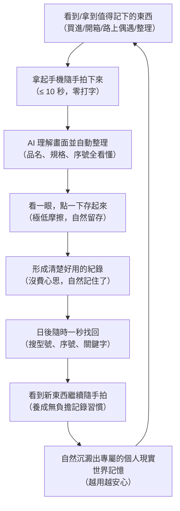

# 1. Product Vision & Positioning

## 1.1 五種定位的根本性重新檢驗

我們對 ItemTrace 的五個可能定位進行深入比對，不只看市場競爭，更從「使用者第一次打開的動機」、「輸入摩擦」、「AI 的真正價值」與「普通人適用性」來檢視：

| 維度 | A. 個人物品庫管理工具 | B. AI 拍照記錄與自動整理 (AI Capture & Organization) | C. 可信物品履歷 (Trustworthy Dossier) | D. 交易存證工具 (Dispute Defense) | E. 居家資產保險盤點 |
|---|---|---|---|---|---|
| **核心賣點** | 登記與管理庫存 | **拍下來，AI 幫你記住，以後找得到** | 完整無法篡改的歷程 | 出貨防調包、防糾紛 | 災難時向保險公司索賠 |
| **首次使用動機** | 想要生活有條理 | **看到/拿到想記的東西，但完全不想花時間整理** | 想為高價物留檔 | 剛被買家坑過、心懷恐懼 | 剛買了房屋保險 |
| **輸入摩擦** | 極高（手動填表填到放棄） | **極低（隨手拍下，AI 理解並整理）** | 中高（需對照規格序號） | 中（需拍包裝細節） | 極高（全家逐間盤點） |
| **AI 的價值** | 輔助填充 | **第一主角（幫忙理解畫面、省下整理時間）** | 提取序號輔助 | 辨識真偽（難度極高） | 影像辨識類別 |
| **使用頻率** | 幾個月一次（常棄坑） | **日常隨手（看到值得留下的東西就拍）** | 轉手時才用 | 只有賣東西時用 | 幾年一次 |
| **心理感受** | 繁重家務感 | **輕鬆、隨手、不用動腦** | 嚴肅專業感 | 焦慮、防備、負面情緒 | 沉重、為災難做準備 |
| **普通人接受度** | 低 | **極高（任何想隨手留下記錄的人都適用）** | 中 | 僅限特定賣家 | 極低 |
| **底層技術對位** | 一般資料庫足矣 | **完美結合 Vision AI 理解力 + 本機安全存儲** | 完美對位 Provenance | 完美對位 SHA-256 | 一般表單足矣 |

### 裁決：確定產品本質為「極簡拍照記錄工具，AI 自動整理」
* **如果定位為 D（存證工具）**：產品情緒極度負面，充滿「防買家」「防糾紛」「存證」等字眼，普通人根本不想打開。
* **如果定位為 C（可信履歷）**：概念過於沉重複雜，使用者還沒體會到好處，就被要求理解「快照目的」「來源關聯」「防篡改證明」。
* **如果定位為 A（物品庫/資產管理）**：把「建立庫存」當成第一步，使用者必須先理解「我要建立一個 Item」，然後開始維護庫存，門檻過高。
* **正確定位**：
  > **一個極簡的拍照記錄工具，底層由 AI 自動整理現實世界中值得留下來的東西。**

使用者不用帶著「我要建庫存」的心態來用它。他只是在生活中看到、買到、遇到一個值得記下來的東西，拿起手機拍一下。  
**AI 幫忙理解它、整理它、記住它；需要的時候，它會自然成為一份清楚的紀錄，讓使用者以後隨時找得到。**  
而 ItemTrace 成熟的 `original/` 照片不可變性、SHA-256、變更事件等強大底層，**則作為「看不見的可靠基石」在後方默默守護**。

---

## 2. Product Vision

> **拍下來，AI 幫你記住，以後找得到。**  
> （Capture it, AI organizes and remembers it, so you can always find it later.）

### 產品宣言
1. **我們解決的核心問題是：「我想留下這個東西的資訊，但我完全不想花時間整理它。」**
2. **AI 的任務是理解現實世界並完成整理，使用者只需要隨手拍、看一眼。**
3. **「物品（Item）」不是使用者一開始要理解的資料表，而是 AI 理解並整理後自然沉澱的成果。**
4. **拍的東西不限於自己的資產：剛買的、路上看到的、收藏品、工具、器材皆可隨手拍；AI 會理解內容，普通照片不強求變成複雜紀錄。**
5. **強大的證明力與可信度留在底層安靜運行，絕不變成日常記錄的認知負擔。**
6. **本機、可攜、開源——你的記憶永遠住在你的硬碟裡，誰也拿不走。**

---

## 3. Product Principles（生活化原則）

### P1. 先拍再說（Capture first）
核心入口永遠是相機。使用者看到值得記的東西，第一動作就是拍下來，沒有任何前置表單或分類選單阻礙。

### P2. AI 幫忙理解與整理（AI understands and organizes）
AI 負責看懂照片、提煉內容、整理成清楚的紀錄；使用者不是在空白表單中輸入，而是看一眼確認「對不對」。

### P3. 人看一眼就存起來（Confirm with ease）
確認過程極致輕盈。AI 整理好了，瞄一眼沒問題點「✓ 存起來」即完成，拒絕強迫性的繁瑣審核流程。

### P4. 照片本身就是第一事實（Photos are the primary reality）
人認東西靠眼睛看，不靠讀文字。在照片流、紀錄卡片與搜尋結果中，照片永遠是第一視覺焦點。

### P5. 不強迫每張照片都成為「物品」（Flexible outcome）
使用者可以拍器材，也可以拍風景、寵物或隨手筆記。AI 理解內容：值得持續記住的實體物品會形成結構化紀錄；隨手的生活照片就單純作為照片保存。

### P6. 找回毫不費力（Effortless retrieval）
當使用者日後需要找回某個東西時，不管記得的是中文品名、模糊型號、半截序號還是外觀特徵，系統都能秒級找回。

### P7. 進階能力安靜守候（Advanced power stays quiet）
不可篡改、SHA-256 哈希、Events 復原、標籤列印、完整封存包匯出等硬核能力，是深藏於底層的保險箱。日常記錄時它們完全隱形，唯有特殊需要時才優雅現身。

---

## 4. 產品飛輪（The Effortless Memory Flywheel）

